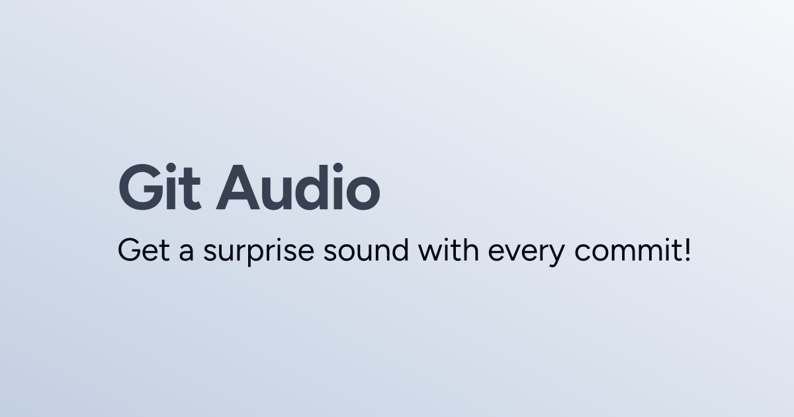

# Git Commit Audio



Add a spark of joy to coding—hear a surprise sound every time you commit. By default, it’s a sitcom laugh track.

[For the Love of Code 2025](https://gh.io/ftloc) hackathon entry.

## Features

- Cross-platform
  - macOS (`afplay`)
  - Linux (`aplay` or `paplay`)
- Quick setup with a single script
- Easily customisable audio (use your own audio)

| File | Description |
| - | - |
| [`audio.wav`](/audio.wav) | The audio |
| [`install.sh`](./install.sh) | Installation script |
| [`post-commit`](./post-commit) | [Git hook](https://git-scm.com/docs/githooks#_post_commit) for manual setup |

## Installation

1. Clone this repository
1. Install the hook into a repository

   ```shell
   cd /path/to/your/repo
   source /path/to/gca/install.sh
   ```
1. Commit!

Later you can change the audio simply by setting the variable:

```shell
# .bashrc, .zshrc, etc.
export GIT_COMMIT_AUDIO="/path/to/your/audio"
```

## Demo

https://github.com/user-attachments/assets/9da2c4f6-9462-4074-a5d4-7a85f6c11e80

## Thanks

- :copilot: [GitHub Copilot](https://gh.io/copilot) for co-piloting
- 🔈 [Freesound](https://freesound.org/s/324894) for the audio
- 📔 [og.new](https://og.new) for the cover image

<div align="center">

</div>
